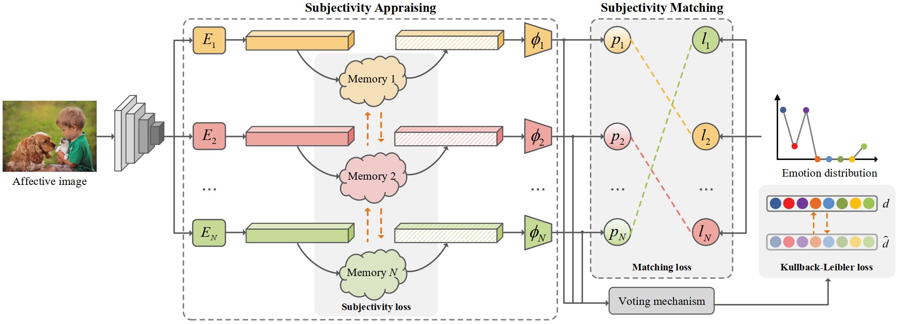

# Seeking subjectivity in visual emotion distribution learning (TIP2022)

Jingyuan Yang; Jie Li; Leida Li; Xiumei Wang; Yuxuan Ding; Xinbo Gao 
### [Paper](https://ieeexplore.ieee.org/abstract/document/9846869)

Visual Emotion Analysis (VEA), which aims to predict people’s emotions towards different visual stimuli, has become an attractive research topic recently. Rather than a single label classification task, it is more rational to regard VEA as a Label Distribution Learning (LDL) problem by voting from different individuals. Existing methods often predict visual emotion distribution in a unified network, neglecting the inherent subjectivity in its crowd voting process. In psychology, the Object-Appraisal-Emotion model has demonstrated that each individual’s emotion is affected by his/her subjective appraisal, which is further formed by the affective memory. Inspired by this, we propose a novel Subjectivity Appraise-and-Match Network (SAMNet) to investigate the subjectivity in visual emotion distribution. To depict the diversity in crowd voting process, we first propose the Subjectivity Appraising with multiple branches, where each branch simulates the emotion evocation process of a specific individual. Specifically, we construct the affective memory with an attention-based mechanism to preserve each individual’s unique emotional experience. A subjectivity loss is further proposed to guarantee the divergence between different individuals. Moreover, we propose the Subjectivity Matching with a matching loss, aiming at assigning unordered emotion labels to ordered individual predictions in a one-to-one correspondence with the Hungarian algorithm. Extensive experiments and comparisons are conducted on public visual emotion distribution datasets, and the results demonstrate that the proposed SAMNet consistently outperforms the state-of-the-art methods. Ablation study verifies the effectiveness of our method and visualization proves its interpretability.

